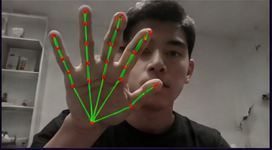
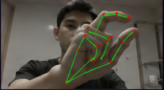
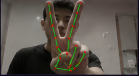
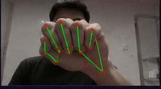

<div align="center">

# AI Virtual Mouse Controller

### *Controle seu computador com gestos da mão.*

[](https://github.com/ognistie/ai-virtual-mouse-controller/actions/workflows/ci.yml)


Webcam → 21 landmarks → cursor do sistema. Sem hardware extra. Sem GPU.

<br/>

<table>
<tr>
<td align="center" width="20%"><br/><sub><b>🖐️ move</b></sub></td>
<td align="center" width="20%"><br/><sub><b>🤏 click</b></sub></td>
<td align="center" width="20%"><br/><sub><b>🤏 right click</b></sub></td>
<td align="center" width="20%"><br/><sub><b>✌️ double click</b></sub></td>
<td align="center" width="20%"><br/><sub><b>✊ pausa</b></sub></td>
</tr>
</table>

<br/>

[**Site oficial →**](https://ognistie.github.io/ai-virtual-mouse-controller/) &nbsp;·&nbsp; [**Guia de uso →**](https://ognistie.github.io/ai-virtual-mouse-controller/usage.html)

</div>

---

## Comece

Requer **Python 3.11 ou 3.12** + webcam.

```bash
pip install ai-virtual-mouse-controller
avmc
```

Ou via clone:

```powershell
git clone https://github.com/ognistie/ai-virtual-mouse-controller.git
cd ai-virtual-mouse-controller && py -3.11 -m venv .venv && .\.venv\Scripts\Activate.ps1
pip install -r requirements.txt && python main.py
```

Posicione a mão a ~50cm da câmera. **`H`** liga o holograma · **`S`** abre o painel · **`ESC`** sai.

<details>
<summary><b>Pré-requisitos por OS</b></summary>

| OS | Setup adicional |
|---|---|
| **🪟 Windows 10/11** | Nada. Funciona out-of-the-box após `pip install`. |
| **🍎 macOS** | Após primeiro run, libere acesso em **System Settings → Privacy & Security → Accessibility** (cursor) e **Camera** (webcam). Em Apple Silicon: se PyAutoGUI reclamar, `pip install pyobjc-core pyobjc`. |
| **🐧 Linux (X11)** | `sudo apt install scrot python3-tk python3-dev` (Ubuntu/Debian). PyAutoGUI precisa desses pra capturar tela. |
| **🐧 Linux (Wayland)** | PyAutoGUI tem suporte limitado. Recomendado mudar pra sessão X11 ou rodar em modo headless de teste. |

Holograma 3D já vem incluído por padrão — basta apertar `H` em runtime. Em ambientes headless (server, sem display): use `pip install ai-virtual-mouse-controller --no-deps` + instale só as deps que precisa.

</details>

---

## O que é

Sistema gestual de controle de cursor com qualidade comparável a periféricos físicos. MediaPipe identifica 21 pontos da sua mão em tempo real, uma state machine traduz gestos em comandos do SO, e um holograma 3D opcional renderiza tudo sobre o desktop.

Stack: **Python 3.11+** · **OpenCV** · **MediaPipe** · **PyAutoGUI** · **NumPy** · **ModernGL** (opcional)

---

<div align="center">

Quer entender a fundo? **[Documentação técnica →](https://ognistie.github.io/ai-virtual-mouse-controller/)**

Quer contribuir? Leia [CONTRIBUTING.md](CONTRIBUTING.md) · Achou bug? [Abra issue](https://github.com/ognistie/ai-virtual-mouse-controller/issues/new?template=bug_report.yml)

<br/>

MIT © [Guilherme Moraes Franco](https://github.com/ognistie)

</div>
